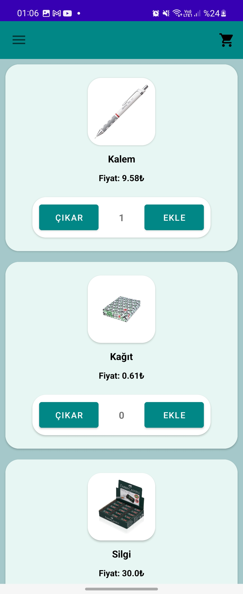
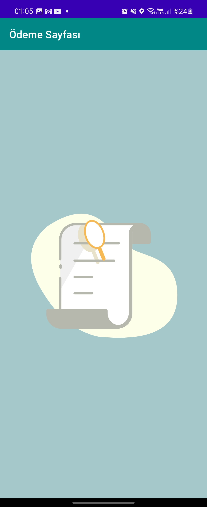
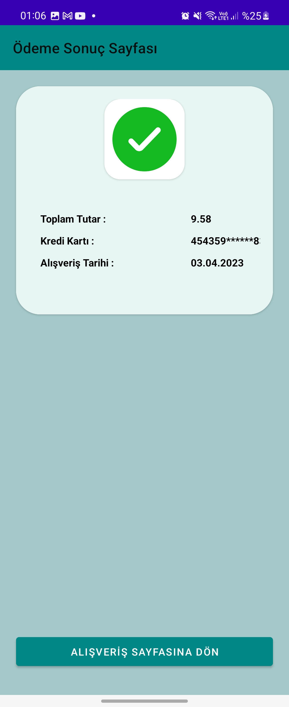

[![LinkedIn][linkedin-shield]][linkedin-url]
# Android - Shopping Application

## About The Project


[//]: # ([![Product Name Screen Shot][product-screenshot]]&#40;&#41;)

This application contains 5 product to buy.

* App uses Mvvm structure. 
* App uses features like data binding, check project for more information.
* App contains Unit Tests.
* App limited with 5 quantities for each product for each buying process. 
* App Uses The Luhn's Algorithm to validate credit card.
* App controls credit card type. Visa or Mastercard ?
* Orders can be abort for just one time.
* Each order which didn't cancel shown on orders page.

<p align="right">(<a href="#readme-top">back to top</a>)</p>

### Built With

Please to build the project use Android Studio.

* [![Android][Next.js]][Next-url]

<p align="right">(<a href="#readme-top">back to top</a>)</p>


<!-- GETTING STARTED -->
## Getting Started


### Installation

_Below is an example of how you can instruct your audience on installing and setting up your app. This template doesn't rely on any external dependencies or services._

1. Clone the repo with the git command below
   ```sh
   https://github.com/umutaykol/ShoppingApplication.git
   ```
2. Open the project on Android Studio


<p align="right">(<a href="#readme-top">back to top</a>)</p>


<!-- USAGE EXAMPLES -->
## Usage

This is a shopping app that contains some dummy products you can buy. 
More than 5 quantities for each product is not permitted.
After adding products to cart you can go to shopping cart and payment screen.

At shopping cart and payment screen you should enter a valid credit card information.
After valid credit card entrance you can complete buying phase and rotate to payment result screen.

Also You can see all orders that you ordered from all orders screen. To rotate
all orders screen please use navigation drawer. Also you can abort your completed orders from this screen.

### Screenshots







<p align="right">(<a href="#readme-top">back to top</a>)</p>


<!-- CONTACT -->
## Contact

Umut Aykol - [@linkedin](https://www.linkedin.com/in/umut-aykol/) - mehmetumutaykol@gmail.com

Project Link: [https://github.com/umutaykol/ShoppingApplication)

<p align="right">(<a href="#readme-top">back to top</a>)</p>


[linkedin-shield]: https://img.shields.io/badge/-LinkedIn-black.svg?style=for-the-badge&logo=linkedin&colorB=555
[linkedin-url]: https://www.linkedin.com/in/umut-aykol/

[product-screenshot]: images/shopping_application.png

[Next.js]: https://img.shields.io/badge/Android%20Studio-3DDC84.svg?style=for-the-badge&logo=android-studio&logoColor=white
[Next-url]: https://developer.android.com/studio